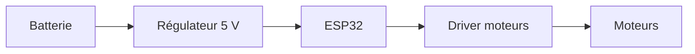

## Architecture

```mermaid
graph LR
  Batterie --> Regulateur[Régulateur 5 V]
  Regulateur --> MCU[ESP32]
  MCU --> Driver[Driver moteurs]
  Driver --> Moteurs
```

## Composants

| Composant | Référence | Quantité |
| --- | --- | --- |
| Microcontrôleur | ESP32-S3 | 1 |

## Câblage


